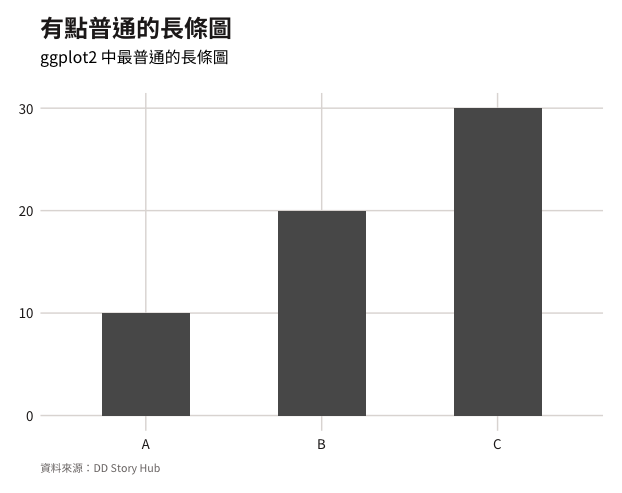
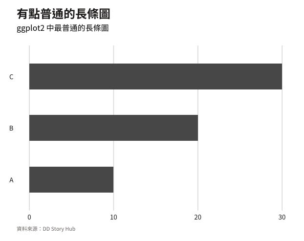
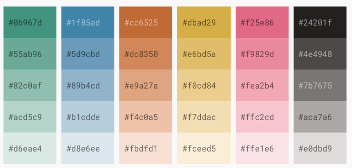
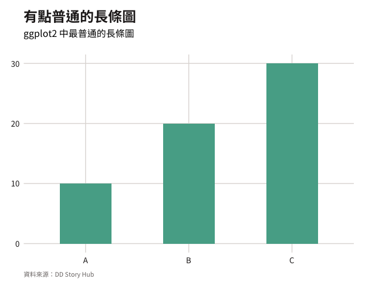
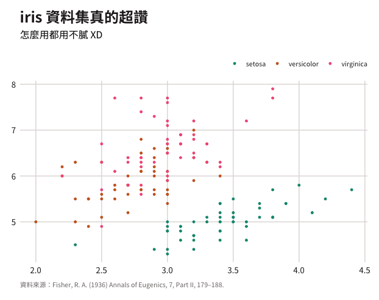
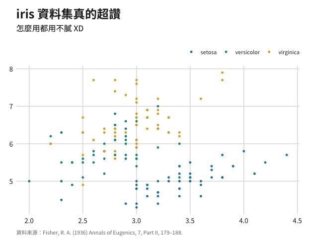
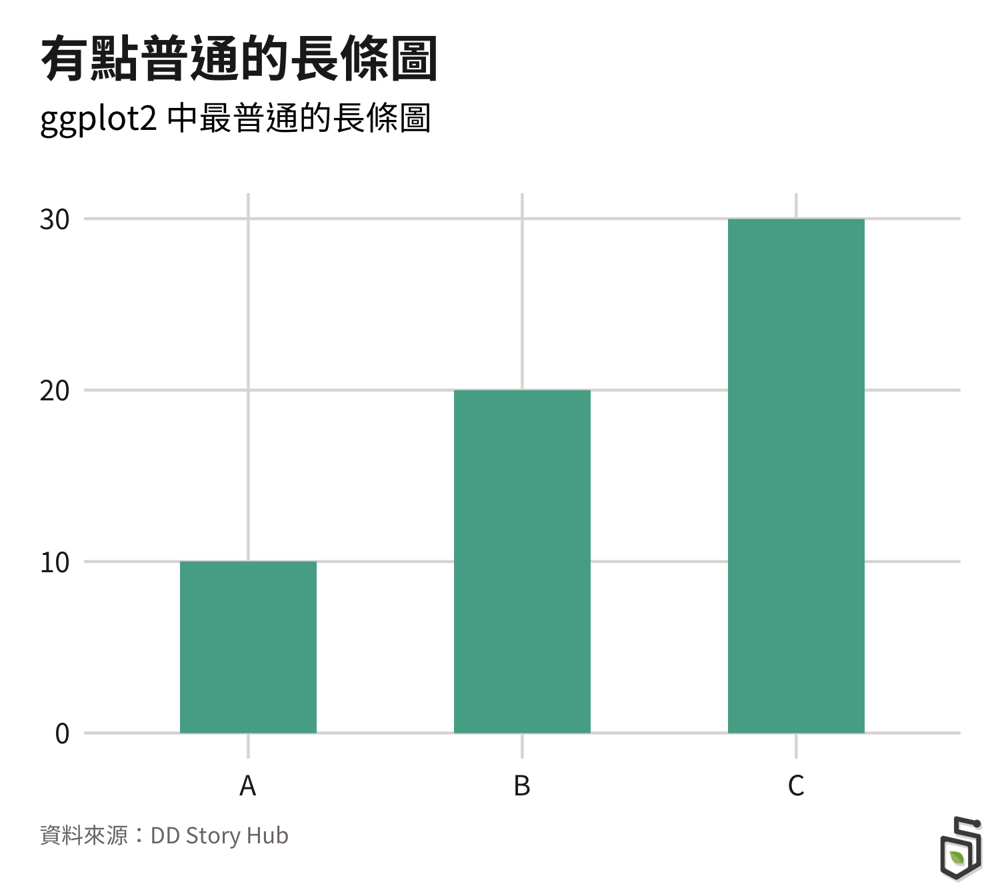

```{r, include = FALSE}
knitr::opts_chunk$set(
  collapse = TRUE,
  comment = "#>",
  fig.path = "man/figures/"
)
```


# ddplot 

[融數基地 DD Story Hub](https://medium.com/dd-story-hub) 的圖表風格化套件，輕易地讓我們製作出 DD 風格的 ggplot2 圖表！

此套件的製作主要參考了[bbplot](https://github.com/bbc/bbplot) 套件，但我們除了主題風格外，也一併把[顏色風格](https://dd-kit.vercel.app/#/DD-chart/color)加入在套件中，並優化一部分 `bbplot` 原有的程式寫法。

## Why `ddplot`?

- 一行 code 直接產出 **Publication Ready** 的圖表
- 快速製作圖表，但又不失品牌風格
- 內建適合圖表顏色的 [DD 圖表色盤](https://dd-kit.vercel.app/#/DD-chart/color)，想用哪個顏色不需要再複製貼上！

## Installation

安裝最新的 `ddplot` 開發版本：
```r
if (!requireNamespace("remotes"))
  install.packages("remotes")
remotes::install_github("DD-Story-Hub/ddplot")
```

### 字體安裝

`ddplot` 圖表字體為 [Noto Sans TC](https://fonts.google.com/specimen/Noto+Sans+TC) 的 Regular, Medium 和 Bold，如果電腦還沒有這個字體，可以透過連結下載安裝👍

## Getting Started

```r
library(ggplot2)
library(ddplot)
```

### `dd_style()`

`dd_style()`是**主題**風格 function，只需要 `+` 上這個 funciton，ggplot 馬上就可以變成我們自己所定義的主題風格！

```r
df <- data.frame(dose = c("A", "B", "C"),
                 len = c(10, 20, 30))


p <- ggplot(data = df, aes(x = dose, y = len)) +
  geom_bar(stat = "identity", width = 0.5) +
  labs(title = '有點普通的長條圖',
       subtitle = 'ggplot2 中最普通的長條圖',
       caption = '資料來源：DD Story Hub') +
  dd_style()
  
p
```

 

什麼？`dd_style()` 看起來跟 `ggplot2` 中內建的 `theme_minimal()` 超級相似啊！為什麼還要自己寫一個呢？沒錯！看起來很相似，但實際上它其實做了很多事：

- 使用我們自己預設的 Nota Sans TC 字體
- 調整主標、副標字體字重及上下間距
- 其他視覺元素(邊界、座標軸、座標軸文字)的 margin 調整
- 格線顏色、粗細微調
- caption, legend 位置調整

這些調整總共需要寫上60行 code，現在只需要1行搞定😊，而且它非常彈性，如果你想要再依照其他特殊情況做細微調整，都可以透過 `theme()` 做微調！例如我想把長條圖 x,y 軸調換方向，但並不想要水平格線（更多的 `theme()` 設定可以參考 [ggplot2官方文件](https://ggplot2.tidyverse.org/reference/theme.html)）：

```r
p +
  coord_flip() +
  theme(panel.grid.major.y = element_blank())
```

 

### `dd_cols()` & `dd_pal()`


顏色是圖表中非常重要的視覺元素之一，所以既然要製作風格化，一定是少不了顏色，這也是 `bbplot` 套件 中沒有製作到的部分。雖然我們目前的圖表色盤並不多，但已經挑選出五種適合圖表的主要顏色，並以這五種顏色為延伸去變換搭配（[DD 圖表色盤](https://dd-kit.vercel.app/#/DD-chart/color)）。

 

而在 `ddplot` 中提供了2個 function 可以直接選擇顏色，分別是可以選擇顏色的 `dd_cols()` 以及選擇色盤的 `dd_pal()`，：

```r
# 最深的藍色
dd_cols('blue500')
#>   blue500 
#> "#1f85ad" 

# 最淺的藍色
dd_cols('blue100')
#>   blue500 
#> "#1f85ad" 

# 主要5色的色盤
dd_pal('main5')(5)
#> [1] "#0B967D" "#1F85AD" "#CC6525" "#DBAD29" "#F25E86"

# 類別5色的色盤
dd_pal('category5')(5)
#> [1] "#0B967D" "#ACD5C9" "#89B4CD" "#F0CD84" "#DC8350"

# 粉紅5色的色盤
dd_pal('pink5')(5)
#> [1] "#F25E86" "#F9829D" "#FEA2B4" "#FFC2CD" "#FFE1E6"
```

這兩個 function 可以讓我們在其他需要用到這些顏色的情況下，以語義化的方式簡單地去選擇DD圖表顏色，像是如我想在 `ggplo2` 中更換 **單類** 圖表的顏色，我們通常只能在 `aes()` 中設定 `fill` or `color`：

```r
ggplot(data = df, aes(x = dose, y = len)) +
  geom_bar(stat = "identity", width = 0.5, fill = dd_cols('green400')) +
  labs(title = '有點普通的長條圖',
       subtitle = 'ggplot2 中最普通的長條圖',
       caption = '資料來源：DD Story Hub') +
  dd_style()
```

 

### `scale_color_dd()` & `scale_fill_dd()`

`scale_*_dd()` 系列的 function 的使用情境是，如果我們想對 **多類** 變數做顏色風格化，就會需要它們，主要有4個參數可以進行設定：

- `palette`: `Character`，選填，選擇你想要使用的色盤，默認值是`"main5"`
- `discrete`: `Boolean`，選填，你的變數是類別變數還是連續變數，默認值是`TRUE`
- `reverse`: `Boolean`，選填，要不要把色盤的順序顛倒過來，默認值是`FALSE`
- `manual.pick`: `Vector`，可以手動挑選 **選定色盤**中的顏色，默認值是`NULL` (EX: `c(1, 3, 5) or c('green500', 'blue500', 'yellow500')`)

使用方式也非常簡單：

```r
ggplot(iris, aes(Sepal.Width, Sepal.Length, color = Species)) +
  geom_point(size = 1) +
  scale_color_dd() +
  dd_style() +
  labs(title="iris 資料集真的超讚",
       subtitle = "怎麼用都用不膩 XD",
       caption = "資料來源：Fisher, R. A. (1936) Annals of Eugenics, 7, Part II, 179–188.")

```

 

此時我們自動給的顏色中，粉紅色和橘色分常接近，想要進行調整，這時就可以用到 `manual.pick` 這個參數：

```r
ggplot(iris, aes(Sepal.Width, Sepal.Length, color = Species)) +
  geom_point(size = 1) +
  scale_color_dd() +
  dd_style() +
  labs(title="iris 資料集真的超讚",
       subtitle = "怎麼用都用不膩 XD",
       caption = "資料來源：Fisher, R. A. (1936) Annals of Eugenics, 7, Part II, 179–188.")

```

 


### `finalise_dd_plot()`

經歷千辛萬苦的資料分析，找出對的視覺化方式，終於要到把圖表放入文章中分享的階段了，最後一步可以使用 `finalise_dd_plot()` 來做這件事情，廢話不多說，直接來看它有什麼魔法！

```r
p <- ggplot(data = df, aes(x = dose, y = len)) +
  geom_bar(stat = "identity", width = 0.5, fill = dd_cols('green400')) +
  labs(title = '有點普通的長條圖',
       subtitle = 'ggplot2 中最普通的長條圖',
       caption = '資料來源：DD Story Hub') +
  dd_style()

finalise_dd_plot(
  plot = p,                 # ggplot2 圖表物件
  path = 'final_plot.png',  # 要儲存的路徑，檔名可以自訂
  width.px = 720,           # 寬度，建議至少 600
  height.px = 640           # 高度，建議至少 600
)
```

 

這個 function 做了幾件事情：

- 自動將 DD Logo 放到右下角
- 將標題、副標題以及資料來源自動切齊，讓畫面更整齊
- 提高圖片畫質

謝謝你看到這邊，我們的 **Publication Ready** 的圖表在此大功告成了🎉，如果有任何開發上的建議或是問題，歡迎到 issue 留言～


